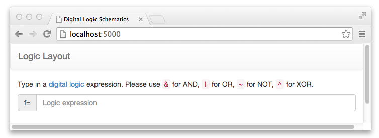
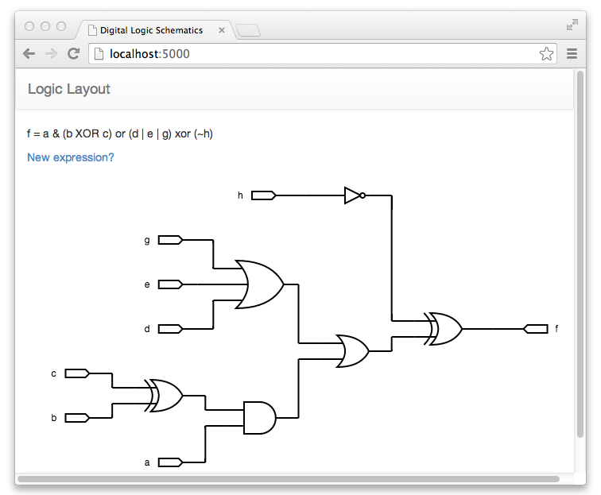

Circuit Design WYSIWYG Webapp
=============================

This app is designed to be a learn tool that enables people to create circuit schematics from Boolean expressions. 

How it works
------------

User goes to the homepage of the webapp and given the option to write a boolean expression and is told the main rules of how to write and expression. 

A circuit schematic is generated from the expression written out.

Things to improve
-----------------
* Make circuit schematic fixed and providing zooming.
* Create a simulator. 
* Add more colorful ways to display a schematic. 
* Enable a user to use and generate VHDL/Verilog code.
