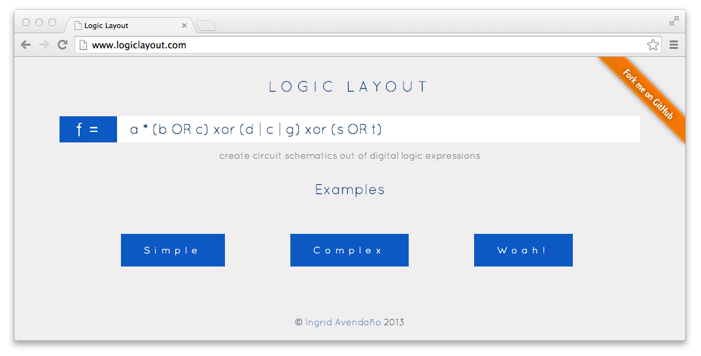
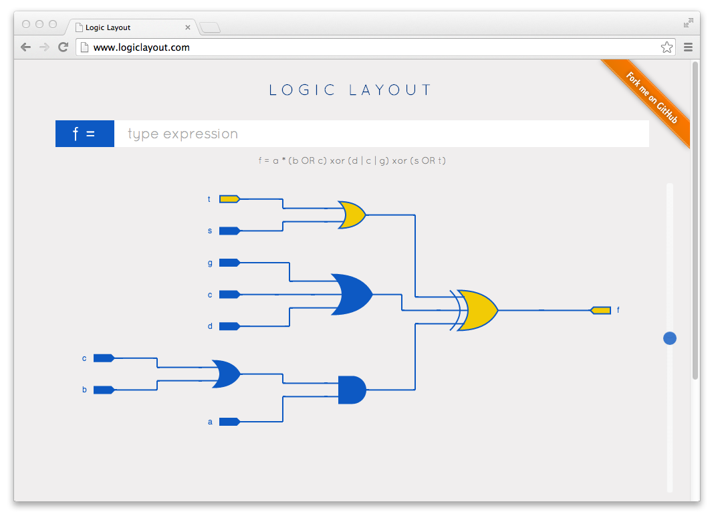
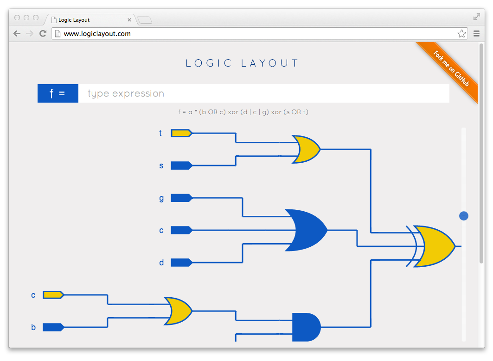

Circuit Design Web App
======================

This web application is designed to be a learning tool that enables people to create interactive circuit schematics from digital logic expressions. 

How it works
------------

User can go to the main page that is a simple flat design and type in a digital logic expression. 

A circuit schematic is generated using HTML canvas using [Paper.js][http://paperjs.org/].

The inputs to the circuit schematic can set to on (1) or off (0), which will change the behavior states of logic gates based on inputs. 

Zooming and drag features are enabled as well. 

Things to improve
-----------------
* ~~Make circuit schematic fixed and providing zooming.~~
* ~~Create a simulator.~~
* ~~Add more colorful ways to display a schematic.~~
* Enable a user to use and generate VHDL/Verilog code.
* Design app to be a WYSIWYG.
* Add screen shot of canvas to export image. 
